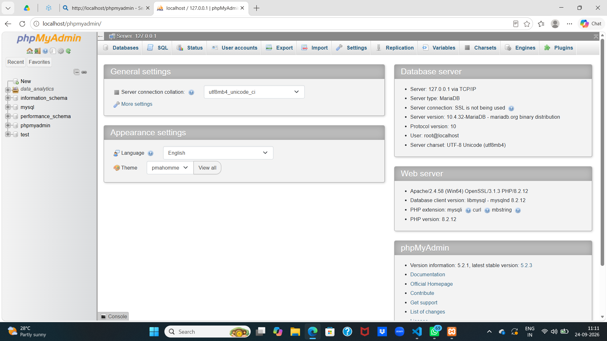

# What is DBMS and RDBMS?

## What is a DBMS?

DBMS stands for **Database Management System**. It is software used to create, store, organize, update, and retrieve data from a database.

A DBMS acts as an interface between users or applications and the database. It allows users to work with data without managing the physical storage directly.

### Examples of DBMS

- MySQL
- Microsoft Access
- MongoDB
- SQLite

### Functions of a DBMS

- Creates and manages databases
- Inserts, updates, and deletes data
- Retrieves data when requested
- Controls user access and permissions
- Provides backup and recovery
- Helps maintain data accuracy and security

## What is an RDBMS?

RDBMS stands for **Relational Database Management System**. It is a type of DBMS that stores data in tables made up of rows and columns.

An RDBMS connects tables using relationships. It commonly uses SQL (Structured Query Language) to create, manage, and retrieve data.

### Examples of RDBMS

- MySQL
- PostgreSQL
- Oracle Database
- Microsoft SQL Server
- SQLite

## Main features of an RDBMS

- Stores data in tables
- Uses rows to represent records
- Uses columns to represent fields
- Uses primary keys to identify records uniquely
- Uses foreign keys to connect tables
- Supports SQL queries
- Enforces data integrity using constraints
- Supports transactions and reliable data processing

## DBMS vs RDBMS

| Feature | DBMS | RDBMS |
|---|---|---|
| Meaning | Database Management System | Relational Database Management System |
| Data storage | May use files, documents, or other formats | Stores data in related tables |
| Relationships | May not support relationships between data | Supports relationships between tables |
| Keys | May not use primary and foreign keys | Uses primary and foreign keys |
| Data structure | Can be flexible | Usually follows a defined table structure |
| Data integrity | Basic support | Strong support through constraints and relationships |
| Transactions | May have limited transaction support | Provides reliable transaction support |
| Examples | MongoDB, Microsoft Access, SQLite | MySQL, PostgreSQL, Oracle, SQL Server |

## Simple example

In an RDBMS, a school database might contain these related tables:

### Students table

| StudentID | Name |
|---|---|
| 101 | Alice |
| 102 | Bob |

### Courses table

| CourseID | CourseName |
|---|---|
| 1 | SQL |
| 2 | Python |

### Enrollments table

| StudentID | CourseID |
|---|---|
| 101 | 1 |
| 102 | 2 |

Here, `StudentID` and `CourseID` connect the tables. This avoids storing the same student and course information repeatedly.

## In summary

- A **DBMS** is software that manages databases.
- An **RDBMS** is a type of DBMS that stores data in related tables.
- Every RDBMS is a DBMS, but every DBMS is not an RDBMS.

# installation of database ?

# xampp

1. open xampp control
2. start server and mysql
3. open browser
4. localhost/phpmyadmin

# how to creste a database

# my sqlworkbench 8.0